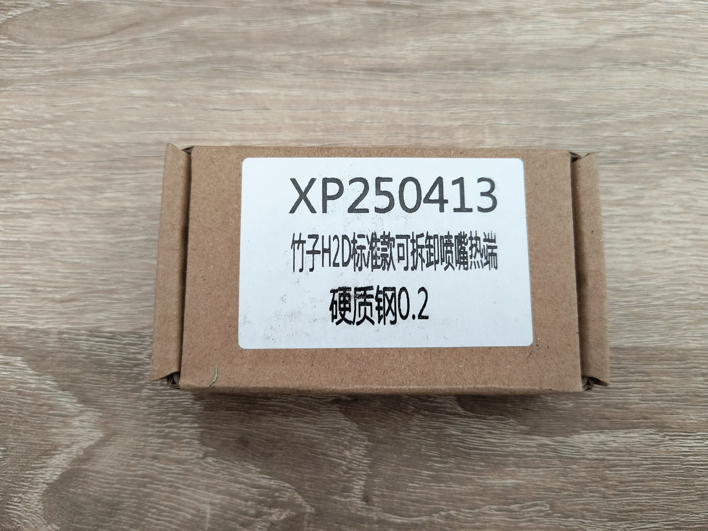
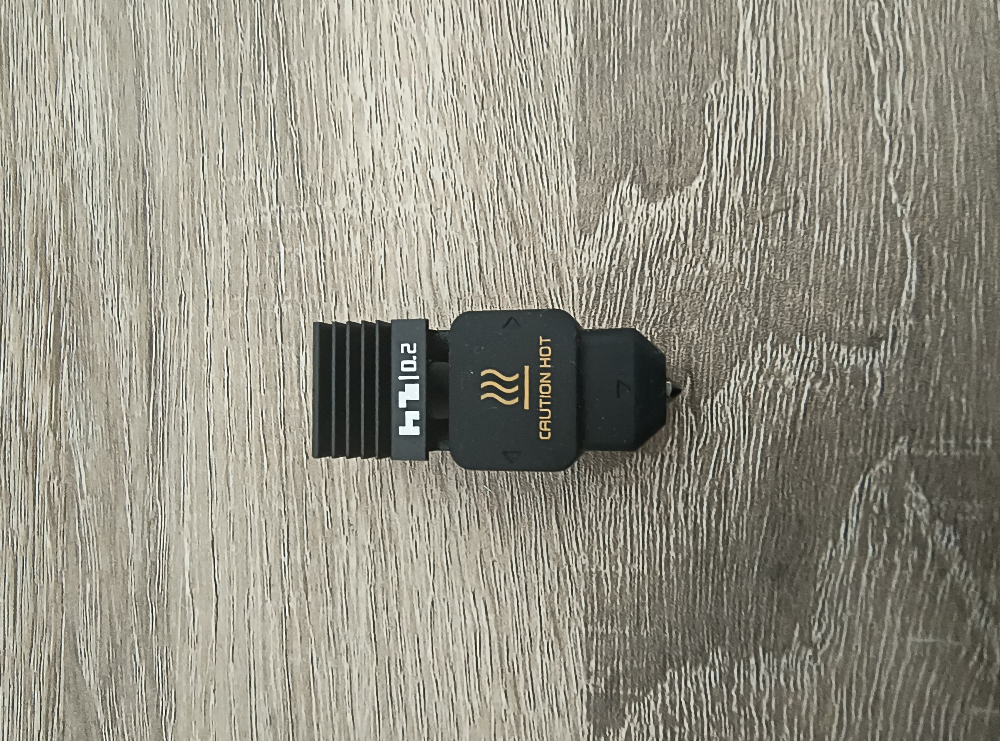

# Generic H2D 0.2mm Nozzle - Numakers PLA+

This folder contains the filament profile and test results for the Generic H2D 0.2mm nozzle used with Numakers PLA+ filament on the Bambu Lab A1 printer.

## Nozzle Information

- **Type**: Generic H2D 0.2mm Nozzle
- **Compatible with**: Bambu Lab A1
- **Amazon Link**: [Henaiser H2D 0.2mm Nozzle](https://www.amazon.in/dp/B0FC2X5BRJ)

## Profile Details

- **Filament**: Numakers PLA+
- **Nozzle Size**: 0.2mm
- **Profile File**: `Numakers PLA + @Bambu Lab A1 0.2 nozzle (H2D Generic).json`

## Important Notes

⚠️ **Z-Offset Adjustment Required**: When testing on the **BIQU Cryogrip frostbite plate**, the Z-offset needs to be set to **0.02mm** to avoid scraping the build plate.

📁 **Profile File Location**: This profile file should be kept **outside the base folder**.

## Images

